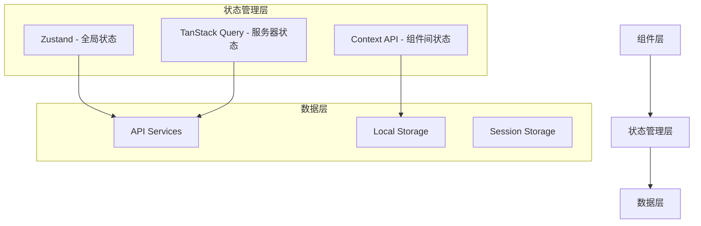

# React/Next.js 状态管理完全指南

## 📖 目录

1. [项目状态管理架构概述](#项目状态管理架构概述)
2. [Zustand 深度学习](#zustand-深度学习)
3. [TanStack Query 深度学习](#tanstack-query-深度学习)
4. [自定义 Hooks 最佳实践](#自定义-hooks-最佳实践)
5. [Context API 适用场景](#context-api-适用场景)
6. [原有方案 vs 现有方案对比](#原有方案-vs-现有方案对比)
7. [实际项目代码示例](#实际项目代码示例)
8. [性能优化策略](#性能优化策略)
9. [测试策略](#测试策略)
10. [社区最佳实践](#社区最佳实践)

## 项目状态管理架构概述

### 🏗️ 三层状态管理架构

我们的项目采用了现代化的三层状态管理架构：



### 📋 状态分类策略

| 状态类型 | 管理工具 | 使用场景 | 示例 |
|---------|---------|---------|------|
| **全局客户端状态** | Zustand | 用户信息、UI偏好、应用配置 | 认证状态、主题设置 |
| **服务器状态** | TanStack Query | API数据、缓存、同步 | 媒体列表、用户信息 |
| **组件间状态** | Context API | 小范围状态传递 | 模态框状态、表单状态 |
| **组件内部状态** | useState/useReducer | 组件私有状态 | 表单输入、开关状态 |

## Zustand 深度学习

### 🎯 为什么选择 Zustand？

**优势对比**：

| 特性 | Zustand | Redux Toolkit | Context API |
|-----|---------|---------------|-------------|
| **学习曲线** | 简单 | 中等 | 简单 |
| **样板代码** | 极少 | 少量 | 中等 |
| **TypeScript支持** | 优秀 | 优秀 | 良好 |
| **性能** | 优秀 | 优秀 | 一般 |
| **DevTools** | 支持 | 优秀 | 有限 |
| **包大小** | 2.6KB | 10KB+ | 内置 |

### 🏗️ 基础概念与架构

#### 1. Store 创建模式

```typescript
// src/store/auth.store.ts - 认证状态管理
import { create } from 'zustand';
import { persist } from 'zustand/middleware';

// 🔥 类型定义先行 - TypeScript最佳实践
interface User {
  id: number;
  uuid: string;
  username: string;
  email: string;
  role: 'USER' | 'ADMIN';
  status: 'ACTIVE' | 'SUSPENDED';
  // ...更多字段
}

interface AuthState {
  // 📌 状态字段
  user: User | null;
  isAuthenticated: boolean;
  isLoading: boolean;

  // 📌 操作方法
  setUser: (user: User | null) => void;
  setLoading: (loading: boolean) => void;
  login: (user: User) => void;
  logout: () => void;
  updateUser: (updates: Partial<User>) => void;

  // 📌 计算方法（选择器）
  isAdmin: () => boolean;
  hasPermission: (permission: string) => boolean;
}

// 🔥 Store 创建 - 核心模式
export const useAuthStore = create<AuthState>()(
  persist(
    (set, get) => ({
      // 初始状态
      user: null,
      isAuthenticated: false,
      isLoading: true,

      // 同步操作 - 直接更新状态
      setUser: (user) => set({
        user,
        isAuthenticated: !!user,
        isLoading: false
      }),

      // 复杂状态更新 - 使用函数式更新
      updateUser: (updates) => set((state) => ({
        user: state.user ? { ...state.user, ...updates } : null
      })),

      // 计算方法 - 获取当前状态进行计算
      isAdmin: () => {
        const { user } = get();
        return user?.role === 'ADMIN' && user?.status === 'ACTIVE';
      },

      // 权限检查逻辑
      hasPermission: (permission) => {
        const { user, isAdmin } = get();
        if (!user || user.status !== 'ACTIVE') return false;
        if (isAdmin()) return true;
        // 更多权限逻辑...
        return false;
      },
    }),
    {
      name: 'auth-storage', // localStorage 键名
      skipHydration: true,   // 避免 SSR 水合问题
      partialize: (state) => ({
        user: state.user,
        isAuthenticated: state.isAuthenticated,
        // 注意：不持久化 isLoading 状态
      }),
    }
  )
);
```

#### 2. 性能优化选择器

```typescript
// 🔥 性能优化 - 创建细粒度选择器避免不必要的重渲染
export const useUser = () => useAuthStore((state) => state.user);
export const useIsAuthenticated = () => useAuthStore((state) => state.isAuthenticated);
export const useIsAdmin = () => useAuthStore((state) => state.isAdmin());

// 🔥 组合选择器 - 多个状态值的组合
export const useAuthInfo = () => useAuthStore((state) => ({
  user: state.user,
  isAuthenticated: state.isAuthenticated,
  isLoading: state.isLoading,
}));

// 🔥 条件选择器 - 基于权限的组件渲染
export const useHasPermission = (permission: string) =>
  useAuthStore((state) => state.hasPermission(permission));
```

#### 3. UI 状态管理模式

```typescript
// src/store/ui.store.ts - UI状态的完整管理
interface UIState {
  // 主题相关
  theme: 'light' | 'dark' | 'system';
  setTheme: (theme: Theme) => void;
  
  // 布局相关
  sidebarState: 'expanded' | 'collapsed' | 'hidden';
  toggleSidebar: () => void;
  setSidebarState: (state: SidebarState) => void;
  
  // 模态框管理
  uploadModal: UploadModalState;
  openUploadModal: (type: 'image' | 'video', files?: File[]) => void;
  closeUploadModal: () => void;
  
  // 确认对话框
  confirmDialog: ConfirmDialogState;
  showConfirm: (config: Partial<ConfirmDialogState>) => void;
  hideConfirm: () => void;
}

export const useUIStore = create<UIState>()(
  persist(
    (set, get) => ({
      // 主题管理
      theme: 'system',
      setTheme: (theme) => {
        set({ theme });
        // 🔥 副作用处理 - 应用主题到DOM
        document.documentElement.classList.toggle('dark', 
          theme === 'dark' || 
          (theme === 'system' && window.matchMedia('(prefers-color-scheme: dark)').matches)
        );
      },
      
      // 侧边栏状态
      sidebarState: 'expanded',
      toggleSidebar: () => set((state) => ({
        sidebarState: state.sidebarState === 'expanded' ? 'collapsed' : 'expanded'
      })),
      
      // 模态框状态管理
      uploadModal: { isOpen: false, type: null },
      openUploadModal: (type, initialFiles) => set({
        uploadModal: { isOpen: true, type, initialFiles }
      }),
      closeUploadModal: () => set({
        uploadModal: { isOpen: false, type: null }
      }),
      
      // 确认对话框
      confirmDialog: { isOpen: false, title: '', message: '' },
      showConfirm: (config) => set((state) => ({
        confirmDialog: { ...state.confirmDialog, ...config, isOpen: true }
      })),
      hideConfirm: () => set((state) => ({
        confirmDialog: { ...state.confirmDialog, isOpen: false }
      })),
    }),
    {
      name: 'ui-storage',
      partialize: (state) => ({
        theme: state.theme,
        sidebarState: state.sidebarState,
      }),
    }
  )
);
```

### 🚀 高级使用模式

#### 1. 异步操作处理

```typescript
// 异步操作的正确处理方式
interface AppState {
  uploads: Upload[];
  isUploading: boolean;
  uploadProgress: number;
  
  // 异步操作
  uploadFiles: (files: File[]) => Promise<void>;
  deleteUpload: (id: string) => Promise<void>;
}

export const useAppStore = create<AppState>()((set, get) => ({
  uploads: [],
  isUploading: false,
  uploadProgress: 0,
  
  uploadFiles: async (files) => {
    set({ isUploading: true, uploadProgress: 0 });
    
    try {
      for (let i = 0; i < files.length; i++) {
        const file = files[i];
        
        // 模拟上传进度
        set({ uploadProgress: ((i + 1) / files.length) * 100 });
        
        // 实际上传逻辑
        const result = await uploadFile(file);
        
        // 更新上传列表
        set((state) => ({
          uploads: [...state.uploads, result]
        }));
      }
    } catch (error) {
      console.error('Upload failed:', error);
      // 错误处理
    } finally {
      set({ isUploading: false, uploadProgress: 0 });
    }
  },
  
  deleteUpload: async (id) => {
    try {
      await deleteUploadAPI(id);
      set((state) => ({
        uploads: state.uploads.filter(upload => upload.id !== id)
      }));
    } catch (error) {
      console.error('Delete failed:', error);
    }
  },
}));
```

#### 2. 中间件组合

```typescript
import { devtools } from 'zustand/middleware';

// 开发环境调试 + 持久化 + 自定义中间件
export const useAuthStore = create<AuthState>()(
  devtools(
    persist(
      (set, get) => ({
        // store 逻辑
      }),
      {
        name: 'auth-storage',
        // 持久化配置
      }
    ),
    {
      name: 'AuthStore', // DevTools 中的显示名称
    }
  )
);
```

## TanStack Query 深度学习

### 🎯 为什么选择 TanStack Query？

TanStack Query (原 React Query) 是现代 React 应用中处理服务器状态的最佳解决方案：

**核心优势**：
- 🚀 自动缓存、同步和更新
- ⚡ 背景重新获取
- 🔄 乐观更新
- 📡 离线支持
- 🎯 重复数据删除
- 🏃‍♂️ 分页和无限滚动

### 🏗️ 核心配置

```typescript
// src/lib/query-client.ts - 核心配置
import { QueryClient } from '@tanstack/react-query';

export const queryClient = new QueryClient({
  defaultOptions: {
    queries: {
      // 🔥 数据新鲜度配置 - 5分钟内认为数据是新鲜的
      staleTime: 5 * 60 * 1000,
      
      // 🔥 缓存时间 - 30分钟后从缓存中移除
      gcTime: 30 * 60 * 1000,
      
      // 🔥 智能重试策略
      retry: (failureCount, error: any) => {
        // 4xx 错误不重试（客户端错误）
        if (error?.status >= 400 && error?.status < 500) {
          return false;
        }
        // 最多重试3次
        return failureCount < 3;
      },
      
      // 🔥 指数退避重试延迟
      retryDelay: (attemptIndex) => Math.min(1000 * 2 ** attemptIndex, 30000),
      
      // 性能优化配置
      refetchOnWindowFocus: false,    // 窗口焦点时不自动重新获取
      refetchOnReconnect: true,       // 网络重连时重新获取
    },
    mutations: {
      // 变更操作重试配置
      retry: (failureCount, error: any) => {
        if (error?.status >= 400 && error?.status < 500) {
          return false;
        }
        return failureCount < 1; // 变更操作最多重试1次
      },
    },
  },
});
```

### 🔑 查询键管理策略

```typescript
// 🔥 查询键工厂模式 - 统一管理所有查询键
export const queryKeys = {
  // 用户相关查询
  users: {
    all: ['users'] as const,
    list: (filters?: any) => ['users', 'list', filters] as const,
    detail: (id: string) => ['users', 'detail', id] as const,
    stats: () => ['users', 'stats'] as const,
  },
  
  // 媒体相关查询 - 支持复杂过滤
  media: {
    all: ['media'] as const,
    list: (filters?: any, page?: number, limit?: number) => 
      ['media', 'list', filters, page, limit] as const,
    detail: (id: string) => ['media', 'detail', id] as const,
    stats: () => ['media', 'stats'] as const,
  },
  
  // 嵌套查询键 - 用于相关数据
  userMedia: {
    all: ['user-media'] as const,
    images: (filters?: any) => [...queryKeys.userMedia.all, 'images', filters] as const,
    videos: (filters?: any) => [...queryKeys.userMedia.all, 'videos', filters] as const,
  }
} as const;

// 🔥 查询工具函数 - 统一的缓存操作
export const queryUtils = {
  // 使所有查询失效
  invalidateAll: () => queryClient.invalidateQueries(),
  
  // 精确失效特定查询
  invalidateQuery: (queryKey: readonly any[]) => 
    queryClient.invalidateQueries({ queryKey }),
  
  // 分类失效
  invalidateUsers: () => queryClient.invalidateQueries({ queryKey: queryKeys.users.all }),
  invalidateMedia: () => queryClient.invalidateQueries({ queryKey: queryKeys.media.all }),
  
  // 数据预取
  prefetchUsers: (filters?: any) =>
    queryClient.prefetchQuery({
      queryKey: queryKeys.users.list(filters),
      queryFn: () => fetchUsers(filters),
    }),
  
  // 乐观更新
  setQueryData: <T>(queryKey: any[], data: T) =>
    queryClient.setQueryData(queryKey, data),
};
```

### 🎣 Query Hooks 实践

#### 1. 基础查询 Hook

```typescript
// src/hooks/queries/useMedia.ts
import { useQuery, useMutation, useInfiniteQuery } from '@tanstack/react-query';

// 🔥 基础查询 - 媒体统计数据
export function useMediaStats() {
  return useQuery<MediaStats, Error>({
    queryKey: queryKeys.media.stats(),
    queryFn: async () => {
      const response = await AdminMediaService.getMediaStats();
      if (!response.success) {
        throw new Error(response.message || 'Failed to fetch media stats');
      }
      return response.data;
    },
    
    // 🔥 配置选项
    staleTime: 1000 * 60 * 5,     // 5分钟新鲜度
    refetchInterval: 1000 * 60 * 5, // 每5分钟自动重新获取
    
    // 🔥 错误重试配置
    retry: (failureCount, error) => {
      // 统计数据失败时重试更积极
      return failureCount < 5;
    },
  });
}

// 🔥 分页查询 - 支持筛选和分页
export function useMediaManagement(filters: MediaFilters, page: number, limit: number) {
  const queryKey = queryKeys.media.list(filters, page, limit);

  const { data, isLoading, error, isError, refetch } = useQuery<PaginatedResponse<Media>, Error>({
    queryKey,
    queryFn: async () => {
      const response = await AdminMediaService.getAllMedia(filters, page, limit);
      if (!response.success) {
        throw new Error(response.message || 'Failed to fetch media');
      }
      return response;
    },
    
    // 🔥 保持之前的数据在获取新数据时显示
    placeholderData: (previousData) => previousData,
    staleTime: 1000 * 60, // 1分钟新鲜度
  });

  // 🔥 数据转换和计算属性
  const media = data?.data || [];
  const pagination = data?.pagination || { page: 1, limit: 20, total: 0, totalPages: 0 };

  return {
    media,
    pagination,
    isLoading,
    error,
    hasError: isError,
    refetchMedia: refetch,
  };
}
```

#### 2. 无限滚动查询

```typescript
// 🔥 无限滚动 - 媒体列表
export function useInfiniteMedia(filters: MediaFilters, limit: number = 24) {
  return useInfiniteQuery({
    queryKey: queryKeys.media.list(filters, 1, limit),
    
    // 🔥 分页查询函数
    queryFn: async ({ pageParam = 1 }) => {
      const response = await AdminMediaService.getAllMedia(filters, pageParam, limit);
      if (!response.success) {
        throw new Error(response.message || 'Failed to fetch media');
      }
      return response;
    },
    
    // 🔥 下一页参数计算
    getNextPageParam: (lastPage) => {
      const { pagination } = lastPage;
      return pagination.page < pagination.totalPages ? pagination.page + 1 : undefined;
    },
    
    initialPageParam: 1,
    staleTime: 1000 * 60, // 1分钟
  });
}

// 🔥 使用无限滚动的组件
function MediaGrid() {
  const [filters, setFilters] = useState<MediaFilters>({});
  
  const {
    data,
    fetchNextPage,
    hasNextPage,
    isFetchingNextPage,
    isLoading,
    isError,
    error,
  } = useInfiniteMedia(filters, 24);

  // 合并所有页面的数据
  const media = useMemo(() => {
    return data?.pages.flatMap(page => page.data || []) || [];
  }, [data]);

  // 无限滚动触发
  const { ref: loadMoreRef } = useIntersectionObserver({
    onIntersect: () => {
      if (hasNextPage && !isFetchingNextPage) {
        fetchNextPage();
      }
    },
  });

  return (
    <div>
      {media.map(item => (
        <MediaCard key={item.id} media={item} />
      ))}
      
      {/* 加载更多触发器 */}
      <div ref={loadMoreRef}>
        {isFetchingNextPage && <LoadingSpinner />}
      </div>
    </div>
  );
}
```

#### 3. Mutation 操作

```typescript
// 🔥 变更操作 - 更新媒体信息
export function useUpdateMediaInfoMutation() {
  const { toast } = useToast();

  return useMutation({
    // 变更函数
    mutationFn: async ({
      mediaId,
      updates
    }: {
      mediaId: string;
      updates: {
        title?: string;
        description?: string;
        tags?: string[];
        categoryId?: string | null;
      }
    }) => {
      // API 调用
      const response = await AdminMediaService.updateMediaInfo(mediaId, {
        title: updates.title,
        description: updates.description,
        tag_ids: updates.tags,
        category_id: updates.categoryId,
      });
      
      if (!response.success) {
        throw new Error(response.message || 'Failed to update media info');
      }
      return response;
    },
    
    // 🔥 成功处理
    onSuccess: (data, variables) => {
      toast({
        title: '更新成功',
        description: '媒体信息已更新',
      });
      
      // 🔥 精确缓存更新
      queryUtils.invalidateMedia();
      queryUtils.invalidateTags();
      queryUtils.invalidateCategories();
    },
    
    // 🔥 错误处理
    onError: (error: Error) => {
      toast({
        title: '更新失败',
        description: error.message || '更新媒体信息失败',
        variant: 'destructive',
      });
    },
  });
}

// 🔥 批量操作 - 批量删除
export function useBatchDeleteMediaMutation() {
  const { toast } = useToast();

  return useMutation({
    mutationFn: async (mediaIds: string[]) => {
      const response = await AdminMediaService.batchDeleteMedia(mediaIds);
      if (!response.success) {
        throw new Error(response.message || 'Failed to batch delete media');
      }
      return response;
    },
    
    // 🔥 复杂成功处理 - 部分成功场景
    onSuccess: (data, mediaIds) => {
      const response = data as any;
      const successCount = response.data?.successCount || 0;
      const failedCount = response.data?.failedCount || 0;
      const failedDetails = response.data?.failedDetails || [];

      if (failedCount > 0) {
        console.error('删除失败的媒体详情:', failedDetails);
        toast({
          title: '部分删除成功',
          description: `成功删除 ${successCount} 个媒体，${failedCount} 个删除失败。`,
          variant: 'default',
        });
      } else {
        toast({
          title: '批量删除成功',
          description: `${successCount} 个媒体已删除`,
        });
      }
      
      queryUtils.invalidateMedia();
    },
    
    onError: (error: Error) => {
      toast({
        title: '批量删除失败',
        description: error.message || '批量删除媒体失败',
        variant: 'destructive',
      });
    },
  });
}
```

### 🔄 乐观更新模式

```typescript
// 🔥 乐观更新 - 点赞功能
export function useLikeMutation() {
  return useMutation({
    mutationFn: async ({ mediaId, liked }: { mediaId: string; liked: boolean }) => {
      return await likeMedia(mediaId, liked);
    },
    
    // 🔥 乐观更新 - 立即更新UI
    onMutate: async ({ mediaId, liked }) => {
      // 取消相关查询，避免覆盖乐观更新
      await queryClient.cancelQueries({ queryKey: queryKeys.media.detail(mediaId) });

      // 获取当前数据
      const previousMedia = queryClient.getQueryData(queryKeys.media.detail(mediaId));

      // 乐观更新
      queryClient.setQueryData(queryKeys.media.detail(mediaId), (old: any) => ({
        ...old,
        liked,
        likes_count: liked ? old.likes_count + 1 : old.likes_count - 1,
      }));

      // 返回回滚数据
      return { previousMedia };
    },
    
    // 🔥 错误回滚
    onError: (err, variables, context) => {
      if (context?.previousMedia) {
        queryClient.setQueryData(queryKeys.media.detail(variables.mediaId), context.previousMedia);
      }
    },
    
    // 🔥 最终同步
    onSettled: (data, error, variables) => {
      queryClient.invalidateQueries({ queryKey: queryKeys.media.detail(variables.mediaId) });
    },
  });
}
```

## 自定义 Hooks 最佳实践

### 🎯 Hook 设计原则

1. **单一职责** - 每个 Hook 只负责一个功能
2. **可复用性** - 设计时考虑多个组件的使用需求
3. **类型安全** - 完整的 TypeScript 类型定义
4. **错误处理** - 统一的错误处理策略

### 🔧 实用 Hook 示例

#### 1. 无限滚动 Hook

```typescript
// src/hooks/useInfiniteScroll.ts
import { useCallback, useRef } from 'react';

interface UseInfiniteScrollOptions {
  onLoadMore: () => void;
  hasMore: boolean;
  isLoading: boolean;
  threshold?: number;
  rootMargin?: string;
}

export function useInfiniteScroll({
  onLoadMore,
  hasMore,
  isLoading,
  threshold = 0.1,
  rootMargin = '100px'
}: UseInfiniteScrollOptions) {
  const observerRef = useRef<IntersectionObserver>();
  
  // 🔥 使用 useCallback 优化性能
  const ref = useCallback((node: HTMLElement | null) => {
    if (isLoading) return;
    
    if (observerRef.current) {
      observerRef.current.disconnect();
    }
    
    observerRef.current = new IntersectionObserver(
      (entries) => {
        if (entries[0].isIntersecting && hasMore) {
          onLoadMore();
        }
      },
      { threshold, rootMargin }
    );
    
    if (node) {
      observerRef.current.observe(node);
    }
  }, [isLoading, hasMore, onLoadMore, threshold, rootMargin]);
  
  return { ref };
}

// 使用示例
function MediaList() {
  const { data, fetchNextPage, hasNextPage, isFetchingNextPage } = useInfiniteMedia();
  
  const { ref } = useInfiniteScroll({
    onLoadMore: fetchNextPage,
    hasMore: !!hasNextPage,
    isLoading: isFetchingNextPage,
  });
  
  return (
    <div>
      {data?.pages.map(page => 
        page.data.map(item => <MediaCard key={item.id} {...item} />)
      )}
      <div ref={ref}>
        {isFetchingNextPage && <LoadingSpinner />}
      </div>
    </div>
  );
}
```

#### 2. 防抖搜索 Hook

```typescript
// src/hooks/useDebounceSearch.ts
import { useState, useEffect, useMemo } from 'react';
import { useQuery } from '@tanstack/react-query';

interface UseDebounceSearchOptions<T> {
  searchFn: (query: string) => Promise<T>;
  delay?: number;
  minLength?: number;
  queryKey: (query: string) => readonly any[];
}

export function useDebounceSearch<T>({
  searchFn,
  delay = 500,
  minLength = 2,
  queryKey
}: UseDebounceSearchOptions<T>) {
  const [searchTerm, setSearchTerm] = useState('');
  const [debouncedSearchTerm, setDebouncedSearchTerm] = useState('');

  // 🔥 防抖逻辑
  useEffect(() => {
    const timer = setTimeout(() => {
      setDebouncedSearchTerm(searchTerm);
    }, delay);

    return () => clearTimeout(timer);
  }, [searchTerm, delay]);

  // 🔥 条件查询 - 只有满足条件才会触发
  const shouldSearch = debouncedSearchTerm.length >= minLength;

  const queryResult = useQuery({
    queryKey: queryKey(debouncedSearchTerm),
    queryFn: () => searchFn(debouncedSearchTerm),
    enabled: shouldSearch,
    staleTime: 1000 * 60 * 5, // 5分钟缓存
  });

  return {
    searchTerm,
    setSearchTerm,
    debouncedSearchTerm,
    shouldSearch,
    ...queryResult,
  };
}

// 使用示例
function SearchComponent() {
  const {
    searchTerm,
    setSearchTerm,
    data: searchResults,
    isLoading,
    isError
  } = useDebounceSearch({
    searchFn: (query) => searchMedia(query),
    queryKey: (query) => ['media', 'search', query],
    delay: 300,
    minLength: 2,
  });

  return (
    <div>
      <input
        value={searchTerm}
        onChange={(e) => setSearchTerm(e.target.value)}
        placeholder="搜索媒体..."
      />
      
      {isLoading && <div>搜索中...</div>}
      {isError && <div>搜索失败</div>}
      
      <div>
        {searchResults?.map(item => (
          <SearchResult key={item.id} {...item} />
        ))}
      </div>
    </div>
  );
}
```

#### 3. 本地存储同步 Hook

```typescript
// src/hooks/useLocalStorage.ts
import { useState, useEffect, useCallback } from 'react';

function useLocalStorage<T>(
  key: string,
  defaultValue: T
): [T, (value: T | ((prev: T) => T)) => void, () => void] {
  // 🔥 惰性初始化 - 避免 SSR 问题
  const [value, setValue] = useState<T>(() => {
    if (typeof window === 'undefined') return defaultValue;
    
    try {
      const item = localStorage.getItem(key);
      return item ? JSON.parse(item) : defaultValue;
    } catch (error) {
      console.error(`Error reading localStorage key "${key}":`, error);
      return defaultValue;
    }
  });

  // 🔥 更新函数 - 支持函数式更新
  const setStoredValue = useCallback((value: T | ((prev: T) => T)) => {
    try {
      const valueToStore = typeof value === 'function' 
        ? (value as (prev: T) => T)(value => value)
        : value;
        
      setValue(valueToStore);
      
      if (typeof window !== 'undefined') {
        localStorage.setItem(key, JSON.stringify(valueToStore));
        
        // 🔥 跨标签页同步
        window.dispatchEvent(new StorageEvent('storage', {
          key,
          newValue: JSON.stringify(valueToStore),
        }));
      }
    } catch (error) {
      console.error(`Error setting localStorage key "${key}":`, error);
    }
  }, [key]);

  // 🔥 删除函数
  const removeValue = useCallback(() => {
    try {
      setValue(defaultValue);
      if (typeof window !== 'undefined') {
        localStorage.removeItem(key);
      }
    } catch (error) {
      console.error(`Error removing localStorage key "${key}":`, error);
    }
  }, [key, defaultValue]);

  // 🔥 监听存储变化 - 支持跨标签页同步
  useEffect(() => {
    if (typeof window === 'undefined') return;

    const handleStorageChange = (e: StorageEvent) => {
      if (e.key === key && e.newValue !== null) {
        try {
          setValue(JSON.parse(e.newValue));
        } catch (error) {
          console.error(`Error parsing localStorage change for key "${key}":`, error);
        }
      }
    };

    window.addEventListener('storage', handleStorageChange);
    return () => window.removeEventListener('storage', handleStorageChange);
  }, [key]);

  return [value, setStoredValue, removeValue];
}
```

## Context API 适用场景

### 🎯 什么时候使用 Context API

Context API 最适合以下场景：

1. **组件树中的小范围状态传递**
2. **主题、国际化等配置信息**
3. **模态框、通知等 UI 组件的状态**
4. **不需要复杂状态管理的简单数据**

### 🔧 Context + Hook 模式

```typescript
// src/contexts/ThemeContext.tsx
import React, { createContext, useContext, useEffect, useState } from 'react';

type Theme = 'light' | 'dark' | 'system';

interface ThemeContextType {
  theme: Theme;
  actualTheme: 'light' | 'dark';
  setTheme: (theme: Theme) => void;
}

const ThemeContext = createContext<ThemeContextType | undefined>(undefined);

// 🔥 自定义 Hook - 封装 Context 使用
export function useTheme() {
  const context = useContext(ThemeContext);
  if (context === undefined) {
    throw new Error('useTheme must be used within a ThemeProvider');
  }
  return context;
}

// 🔥 Provider 组件
export function ThemeProvider({ children }: { children: React.ReactNode }) {
  const [theme, setTheme] = useState<Theme>('system');
  const [actualTheme, setActualTheme] = useState<'light' | 'dark'>('light');

  // 🔥 系统主题检测
  useEffect(() => {
    const mediaQuery = window.matchMedia('(prefers-color-scheme: dark)');
    
    const updateActualTheme = () => {
      const newActualTheme = theme === 'system' 
        ? (mediaQuery.matches ? 'dark' : 'light')
        : theme as 'light' | 'dark';
      
      setActualTheme(newActualTheme);
      
      // 应用到 DOM
      document.documentElement.classList.toggle('dark', newActualTheme === 'dark');
    };

    updateActualTheme();
    mediaQuery.addListener(updateActualTheme);
    
    return () => mediaQuery.removeListener(updateActualTheme);
  }, [theme]);

  const value = {
    theme,
    actualTheme,
    setTheme,
  };

  return (
    <ThemeContext.Provider value={value}>
      {children}
    </ThemeContext.Provider>
  );
}

// 使用示例
function ThemeToggle() {
  const { theme, setTheme } = useTheme();
  
  return (
    <button onClick={() => setTheme(theme === 'dark' ? 'light' : 'dark')}>
      {theme === 'dark' ? '🌙' : '☀️'}
    </button>
  );
}
```

## 原有方案 vs 现有方案对比

### 📊 传统状态管理问题

#### Redux 的问题：
```typescript
// ❌ 传统 Redux - 样板代码过多
// actions.ts
const FETCH_USERS_REQUEST = 'FETCH_USERS_REQUEST';
const FETCH_USERS_SUCCESS = 'FETCH_USERS_SUCCESS';
const FETCH_USERS_FAILURE = 'FETCH_USERS_FAILURE';

interface FetchUsersRequestAction {
  type: typeof FETCH_USERS_REQUEST;
}

interface FetchUsersSuccessAction {
  type: typeof FETCH_USERS_SUCCESS;
  payload: User[];
}

// ... 大量类型定义和 action creators

// reducer.ts
function usersReducer(state = initialState, action: UserActionTypes) {
  switch (action.type) {
    case FETCH_USERS_REQUEST:
      return { ...state, loading: true, error: null };
    case FETCH_USERS_SUCCESS:
      return { ...state, loading: false, users: action.payload };
    // ... 更多 cases
    default:
      return state;
  }
}

// 使用时需要 dispatch 和复杂的异步处理
```

#### 现有方案的优势：
```typescript
// ✅ Zustand + TanStack Query - 简洁明了
// 全局状态
const useAppStore = create((set) => ({
  user: null,
  setUser: (user) => set({ user }),
}));

// 服务器状态
const useUsers = () => useQuery({
  queryKey: ['users'],
  queryFn: fetchUsers,
});

// 组件中使用
function UserComponent() {
  const { data: users, isLoading } = useUsers();
  const { user } = useAppStore();
  
  if (isLoading) return <div>Loading...</div>;
  return <div>{users?.map(u => u.name)}</div>;
}
```

### 🚀 性能对比

| 方案 | Bundle Size | 学习曲线 | 开发体验 | 类型支持 | 调试体验 |
|------|-------------|----------|----------|----------|----------|
| **Redux Toolkit** | ~10KB | 中等 | 中等 | 优秀 | 优秀 |
| **Zustand** | ~2.6KB | 简单 | 优秀 | 优秀 | 良好 |
| **React Query** | ~12KB | 中等 | 优秀 | 优秀 | 优秀 |
| **组合方案** | ~15KB | 简单 | 优秀 | 优秀 | 优秀 |
| **原生 Context** | 0KB | 简单 | 一般 | 良好 | 一般 |

## 实际项目代码示例

### 🏗️ 完整的媒体管理功能实现

#### 1. 服务层

```typescript
// src/services/admin-media.service.ts
export class AdminMediaService {
  static async getAllMedia(
    filters: MediaFilters = {},
    page: number = 1,
    limit: number = 20
  ): Promise<PaginatedResponse<Media>> {
    const params = { page, limit, ...filters };
    const response = await apiClient.get('/admin/media', { params });
    return response as PaginatedResponse<Media>;
  }

  static async batchDeleteMedia(mediaIds: string[]): Promise<ApiResponse<any>> {
    const response = await apiClient.post('/admin/media/batch/delete', { mediaIds });
    return response as ApiResponse<any>;
  }
}
```

#### 2. 查询层

```typescript
// src/hooks/queries/useMedia.ts
export function useInfiniteMedia(filters: MediaFilters, limit: number = 24) {
  return useInfiniteQuery({
    queryKey: queryKeys.media.list(filters, 1, limit),
    queryFn: async ({ pageParam = 1 }) => {
      const response = await AdminMediaService.getAllMedia(filters, pageParam, limit);
      if (!response.success) {
        throw new Error(response.message || 'Failed to fetch media');
      }
      return response;
    },
    getNextPageParam: (lastPage) => {
      const { pagination } = lastPage;
      return pagination.page < pagination.totalPages ? pagination.page + 1 : undefined;
    },
    initialPageParam: 1,
  });
}
```

#### 3. 组件层

```typescript
// src/app/admin/media/page.tsx
export default function MediaManagementPage() {
  // 🔥 本地状态
  const [searchTerm, setSearchTerm] = useState('');
  const [selectedMedia, setSelectedMedia] = useState<string[]>([]);
  
  // 🔥 全局状态
  const { user } = useAuthStore();
  const { showConfirm } = useUIStore();
  
  // 🔥 服务器状态
  const apiFilters = useMemo(() => ({
    search: searchTerm.trim() || undefined,
  }), [searchTerm]);
  
  const {
    data,
    fetchNextPage,
    hasNextPage,
    isFetchingNextPage,
    isLoading,
  } = useInfiniteMedia(apiFilters, 24);
  
  // 🔥 变更操作
  const batchDeleteMutation = useBatchDeleteMediaMutation();
  
  // 🔥 事件处理
  const handleBatchDelete = useCallback(() => {
    showConfirm({
      title: '确认批量删除',
      message: `确定要删除选中的 ${selectedMedia.length} 个媒体文件吗？`,
      onConfirm: () => {
        batchDeleteMutation.mutate(selectedMedia);
        setSelectedMedia([]);
      },
    });
  }, [selectedMedia, batchDeleteMutation, showConfirm]);
  
  // 合并数据
  const media = useMemo(() => {
    return data?.pages.flatMap(page => page.data || []) || [];
  }, [data]);

  return (
    <div>
      <SearchInput 
        value={searchTerm}
        onChange={setSearchTerm}
        placeholder="搜索媒体..."
      />
      
      {selectedMedia.length > 0 && (
        <BatchActions>
          <Button 
            onClick={handleBatchDelete}
            disabled={batchDeleteMutation.isPending}
          >
            删除选中 ({selectedMedia.length})
          </Button>
        </BatchActions>
      )}
      
      <MediaGrid>
        {media.map(item => (
          <MediaCard
            key={item.id}
            media={item}
            isSelected={selectedMedia.includes(item.id)}
            onToggleSelect={handleToggleSelect}
          />
        ))}
      </MediaGrid>
      
      <InfiniteScrollTrigger
        onLoadMore={fetchNextPage}
        hasMore={hasNextPage}
        isLoading={isFetchingNextPage}
      />
    </div>
  );
}
```

## 性能优化策略

### 🚀 React Query 性能优化

#### 1. 查询键优化

```typescript
// ❌ 错误做法 - 每次都创建新的查询键
function MediaList({ userId, filters }) {
  const { data } = useQuery({
    queryKey: ['media', { userId, ...filters }], // 对象每次都不同
    queryFn: () => fetchMedia(userId, filters),
  });
}

// ✅ 正确做法 - 使用查询键工厂
function MediaList({ userId, filters }) {
  const { data } = useQuery({
    queryKey: queryKeys.media.list(filters, userId), // 结构化的键
    queryFn: () => fetchMedia(userId, filters),
  });
}
```

#### 2. 选择性失效

```typescript
// ❌ 过度失效 - 影响所有媒体查询
queryClient.invalidateQueries();

// ✅ 精确失效 - 只影响特定查询
queryClient.invalidateQueries({ 
  queryKey: queryKeys.media.list(currentFilters) 
});

// ✅ 部分匹配失效 - 影响所有媒体相关查询
queryClient.invalidateQueries({ 
  queryKey: queryKeys.media.all 
});
```

#### 3. 数据预取

```typescript
// 🔥 路由预取 - 在用户可能访问前预取数据
function usePreloadMediaDetail(mediaId: string) {
  const queryClient = useQueryClient();
  
  return useCallback(() => {
    queryClient.prefetchQuery({
      queryKey: queryKeys.media.detail(mediaId),
      queryFn: () => fetchMediaDetail(mediaId),
      staleTime: 1000 * 60 * 5, // 5分钟内不重复预取
    });
  }, [mediaId, queryClient]);
}

// 使用
function MediaCard({ media }) {
  const preloadDetail = usePreloadMediaDetail(media.id);
  
  return (
    <div onMouseEnter={preloadDetail}>
      <Link href={`/media/${media.id}`}>
        {media.title}
      </Link>
    </div>
  );
}
```

### 🎯 Zustand 性能优化

#### 1. 选择器优化

```typescript
// ❌ 会导致不必要的重渲染
function Component() {
  const { user, settings, notifications } = useAppStore();
  return <div>{user.name}</div>; // 只用了 user，但其他变化也会重渲染
}

// ✅ 精确选择
function Component() {
  const userName = useAppStore(state => state.user.name);
  return <div>{userName}</div>;
}

// ✅ 稳定的选择器
const selectUserInfo = (state) => ({
  name: state.user.name,
  email: state.user.email,
});

function Component() {
  const userInfo = useAppStore(selectUserInfo);
  return <div>{userInfo.name}</div>;
}
```

#### 2. 状态分割

```typescript
// ❌ 单一巨大状态 - 任何变化都会影响所有订阅者
const useAppStore = create((set) => ({
  user: null,
  posts: [],
  comments: [],
  ui: { theme: 'light', sidebar: 'open' },
  // ... 更多状态
}));

// ✅ 按功能分割状态
const useAuthStore = create((set) => ({
  user: null,
  setUser: (user) => set({ user }),
}));

const usePostsStore = create((set) => ({
  posts: [],
  setPosts: (posts) => set({ posts }),
}));

const useUIStore = create((set) => ({
  theme: 'light',
  sidebar: 'open',
  setTheme: (theme) => set({ theme }),
}));
```

## 测试策略

### 🧪 单元测试

#### 1. Zustand Store 测试

```typescript
// src/store/__tests__/auth.store.test.ts
import { renderHook, act } from '@testing-library/react';
import { useAuthStore } from '../auth.store';

describe('AuthStore', () => {
  beforeEach(() => {
    useAuthStore.getState().logout();
  });

  it('should initialize with empty state', () => {
    const { result } = renderHook(() => useAuthStore());
    
    expect(result.current.user).toBe(null);
    expect(result.current.isAuthenticated).toBe(false);
  });

  it('should login user correctly', () => {
    const mockUser = {
      id: 1,
      username: 'testuser',
      email: 'test@example.com',
      role: 'USER' as const,
      status: 'ACTIVE' as const,
    };

    const { result } = renderHook(() => useAuthStore());

    act(() => {
      result.current.login(mockUser);
    });

    expect(result.current.user).toEqual(mockUser);
    expect(result.current.isAuthenticated).toBe(true);
  });

  it('should check admin permission correctly', () => {
    const { result } = renderHook(() => useAuthStore());

    // Regular user
    act(() => {
      result.current.login({
        id: 1,
        username: 'user',
        role: 'USER',
        status: 'ACTIVE',
      });
    });
    
    expect(result.current.isAdmin()).toBe(false);

    // Admin user
    act(() => {
      result.current.login({
        id: 2,
        username: 'admin',
        role: 'ADMIN',
        status: 'ACTIVE',
      });
    });
    
    expect(result.current.isAdmin()).toBe(true);
  });
});
```

#### 2. React Query Hook 测试

```typescript
// src/hooks/__tests__/useMedia.test.tsx
import { renderHook, waitFor } from '@testing-library/react';
import { QueryClient, QueryClientProvider } from '@tanstack/react-query';
import { useMediaStats } from '../queries/useMedia';
import * as MediaService from '@/services/admin-media.service';

// Mock service
jest.mock('@/services/admin-media.service');
const mockMediaService = MediaService as jest.Mocked<typeof MediaService>;

const createWrapper = () => {
  const queryClient = new QueryClient({
    defaultOptions: {
      queries: { retry: false },
      mutations: { retry: false },
    },
  });

  return ({ children }: { children: React.ReactNode }) => (
    <QueryClientProvider client={queryClient}>
      {children}
    </QueryClientProvider>
  );
};

describe('useMediaStats', () => {
  beforeEach(() => {
    jest.clearAllMocks();
  });

  it('should fetch media stats successfully', async () => {
    const mockStats = {
      total: 100,
      images: 60,
      videos: 40,
    };

    mockMediaService.AdminMediaService.getMediaStats.mockResolvedValue({
      success: true,
      data: mockStats,
    });

    const { result } = renderHook(() => useMediaStats(), {
      wrapper: createWrapper(),
    });

    expect(result.current.isLoading).toBe(true);

    await waitFor(() => {
      expect(result.current.isSuccess).toBe(true);
    });

    expect(result.current.data).toEqual(mockStats);
  });

  it('should handle fetch error', async () => {
    mockMediaService.AdminMediaService.getMediaStats.mockResolvedValue({
      success: false,
      message: 'Failed to fetch stats',
    });

    const { result } = renderHook(() => useMediaStats(), {
      wrapper: createWrapper(),
    });

    await waitFor(() => {
      expect(result.current.isError).toBe(true);
    });

    expect(result.current.error?.message).toBe('Failed to fetch stats');
  });
});
```

### 🔗 集成测试

```typescript
// src/components/__tests__/MediaManagement.integration.test.tsx
import { render, screen, fireEvent, waitFor } from '@testing-library/react';
import MediaManagementPage from '../admin/media/page';
import { QueryClient, QueryClientProvider } from '@tanstack/react-query';
import { useAuthStore } from '@/store/auth.store';

const renderWithProviders = (ui: React.ReactElement) => {
  const queryClient = new QueryClient({
    defaultOptions: {
      queries: { retry: false },
      mutations: { retry: false },
    },
  });

  return render(
    <QueryClientProvider client={queryClient}>
      {ui}
    </QueryClientProvider>
  );
};

describe('MediaManagementPage Integration', () => {
  beforeEach(() => {
    // Setup admin user
    useAuthStore.getState().login({
      id: 1,
      username: 'admin',
      role: 'ADMIN',
      status: 'ACTIVE',
    });
  });

  it('should load and display media items', async () => {
    renderWithProviders(<MediaManagementPage />);

    expect(screen.getByText('媒体内容管理')).toBeInTheDocument();
    expect(screen.getByPlaceholderText('搜索标题、描述或用户...')).toBeInTheDocument();

    // Wait for data to load
    await waitFor(() => {
      expect(screen.queryByText('加载中...')).not.toBeInTheDocument();
    });
  });

  it('should handle batch selection and deletion', async () => {
    renderWithProviders(<MediaManagementPage />);

    await waitFor(() => {
      expect(screen.queryByText('加载中...')).not.toBeInTheDocument();
    });

    // Select all items
    const selectAllButton = screen.getByText('全选');
    fireEvent.click(selectAllButton);

    // Should show batch actions
    expect(screen.getByText(/批量删除/)).toBeInTheDocument();

    // Click batch delete
    fireEvent.click(screen.getByText(/批量删除/));

    // Should show confirmation dialog
    await waitFor(() => {
      expect(screen.getByText('确认批量删除')).toBeInTheDocument();
    });
  });
});
```

## 社区最佳实践

### 📚 官方推荐模式

#### 1. Zustand 官方最佳实践

- **[Zustand 官方文档](https://github.com/pmndrs/zustand)**
- **中间件组合**：persist + devtools + immer
- **TypeScript 集成**：完整的类型推导
- **性能优化**：使用选择器避免不必要的重渲染

#### 2. TanStack Query 官方模式

- **[TanStack Query 官方文档](https://tanstack.com/query/latest)**
- **查询键管理**：使用工厂模式统一管理
- **错误边界**：配合 React Error Boundary
- **离线支持**：结合 PWA 实现离线功能

### 🌟 社区推荐架构

```typescript
// 📁 推荐的项目结构
src/
├── components/           # UI 组件
│   ├── ui/              # 基础 UI 组件
│   └── business/        # 业务组件
├── hooks/               # 自定义 Hooks
│   ├── queries/         # React Query hooks
│   ├── mutations/       # 变更操作 hooks
│   └── utils/           # 工具 hooks
├── lib/                 # 核心库配置
│   ├── query-client.ts  # React Query 配置
│   └── api-client.ts    # API 客户端
├── services/            # API 服务层
├── store/               # Zustand stores
├── types/               # TypeScript 类型定义
└── utils/               # 工具函数
```

### 🔥 高级模式

#### 1. 状态同步模式

```typescript
// 🔥 Zustand 与 React Query 的状态同步
export const useAuthSync = () => {
  const { setUser, logout } = useAuthStore();
  
  // 监听认证状态变化
  useEffect(() => {
    const unsubscribe = queryClient.getQueryCache().subscribe((event) => {
      if (event.type === 'observerResultsUpdated') {
        const query = event.query;
        
        // 如果任何查询返回 401，自动登出
        if (query.state.error?.status === 401) {
          logout();
          queryClient.clear(); // 清除所有缓存
        }
      }
    });

    return unsubscribe;
  }, [logout]);
};
```

#### 2. 乐观更新 + 冲突解决

```typescript
// 🔥 复杂乐观更新 - 处理并发冲突
export function useOptimisticUpdate() {
  return useMutation({
    mutationFn: updateData,
    
    onMutate: async (newData) => {
      await queryClient.cancelQueries({ queryKey: ['data'] });
      
      const previousData = queryClient.getQueryData(['data']);
      const optimisticData = { ...previousData, ...newData };
      
      queryClient.setQueryData(['data'], optimisticData);
      
      return { previousData, optimisticData };
    },
    
    onError: (err, newData, context) => {
      // 回滚乐观更新
      if (context?.previousData) {
        queryClient.setQueryData(['data'], context.previousData);
      }
    },
    
    onSuccess: (data, variables, context) => {
      // 检查服务器返回的数据是否与乐观更新一致
      if (JSON.stringify(data) !== JSON.stringify(context?.optimisticData)) {
        // 存在冲突，使用服务器数据
        queryClient.setQueryData(['data'], data);
        
        // 可以显示冲突提示
        toast({
          title: '数据已更新',
          description: '服务器数据与本地更新存在差异，已同步最新数据',
        });
      }
    },
    
    onSettled: () => {
      queryClient.invalidateQueries({ queryKey: ['data'] });
    },
  });
}
```

### 📖 学习资源

1. **官方文档**
   - [Zustand](https://github.com/pmndrs/zustand)
   - [TanStack Query](https://tanstack.com/query/latest)
   - [React Hook Form](https://react-hook-form.com/)

2. **社区资源**
   - [React Query 最佳实践](https://react-query.tanstack.com/guides/best-practices)
   - [Zustand 模式集合](https://github.com/pmndrs/zustand/wiki/Recipes)

3. **性能工具**
   - React DevTools Profiler
   - React Query DevTools
   - Zustand DevTools

---

## 🎉 总结

现代 React/Next.js 应用的状态管理已经从复杂的 Redux 模式演进为更简洁、更高效的组合方案：

- **Zustand** 处理客户端全局状态，简洁且高性能
- **TanStack Query** 管理服务器状态，提供强大的缓存和同步能力
- **Context API** 处理小范围的组件状态传递
- **自定义 Hooks** 封装复杂逻辑，提升代码复用性

这种架构不仅减少了样板代码，还提供了更好的开发体验和性能表现。配合完善的 TypeScript 支持，能够构建出健壮、可维护的现代化 React 应用。

**下一步建议**：
1. 实践更多的乐观更新场景
2. 探索离线支持和 PWA 集成
3. 学习更多性能优化技巧
4. 深入理解 React 18 的并发特性与状态管理的结合