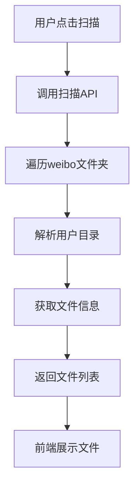
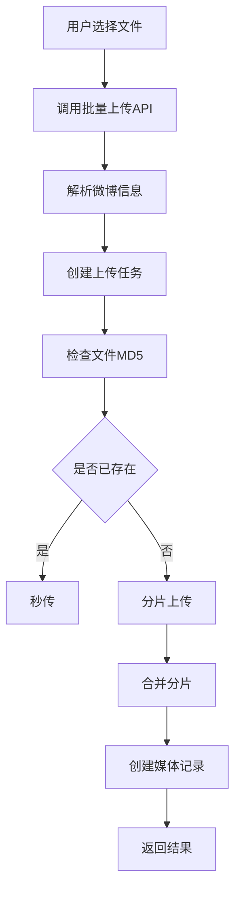
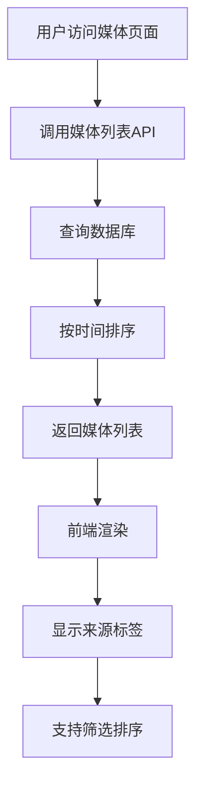

# 微博导入功能增强版实现文档

## 概述

本文档描述了微博导入功能的增强版实现，包括数据库设计改进、媒体来源管理、原始创建时间支持等功能。

## 🎯 核心特性

### 1. 统一媒体管理
- **单一数据表设计**：使用 `Media` 表统一管理用户上传和微博爬取的媒体文件
- **来源标识**：通过 `source` 字段区分不同来源的媒体文件
- **原始时间**：保存微博原始发布时间用于排序和筛选
- **元数据存储**：使用 JSON 字段存储来源相关的详细信息

### 2. 智能信息解析
- **路径解析**：从文件路径自动提取微博用户ID
- **文件名解析**：从文件名提取微博ID和发布日期
- **分类识别**：自动识别原创微博图片、视频、Live Photo等类型
- **时间转换**：将文件名中的日期格式转换为标准时间戳

### 3. 用户体验优化
- **来源标识**：在界面上显示媒体来源标签
- **时间筛选**：支持按原始创建时间排序和筛选
- **统一展示**：用户上传和微博媒体在同一界面展示

## 🗄️ 数据库设计

### Media 表结构变更

```sql
-- 新增字段
ALTER TABLE media ADD COLUMN source MediaSource DEFAULT 'USER_UPLOAD';
ALTER TABLE media ADD COLUMN original_created_at TIMESTAMP;
ALTER TABLE media ADD COLUMN source_metadata JSONB;

-- 新增枚举类型
CREATE TYPE MediaSource AS ENUM (
  'USER_UPLOAD',   -- 用户上传
  'WEIBO_CRAWL',   -- 微博爬取
  'API_IMPORT',    -- API导入
  'BATCH_IMPORT'   -- 批量导入
);

-- 新增索引
CREATE INDEX idx_media_source_time ON media(source, original_created_at);
```

### 字段说明

| 字段 | 类型 | 说明 |
|------|------|------|
| `source` | `MediaSource` | 媒体来源标识 |
| `original_created_at` | `TIMESTAMP` | 原始创建时间（微博发布时间） |
| `source_metadata` | `JSONB` | 来源相关元数据 |

### 元数据结构

```json
{
  "weiboUserId": "6387099968",
  "weiboId": "5178828026545249",
  "originalPath": "/path/to/weibo/file.jpg",
  "crawlSource": "weibo-crawler",
  "mediaCategory": "原创微博图片",
  "importedAt": "2025-01-07T10:30:00Z"
}
```

## 🔧 后端实现

### 1. 微博信息解析

```typescript
private parseWeiboInfo(filePath: string, fileName: string): any {
  // 提取微博用户ID
  const pathParts = filePath.split(path.sep);
  const weiboIndex = pathParts.findIndex(part => part === 'weibo');
  let weiboUserId: string | null = null;
  if (weiboIndex >= 0 && weiboIndex < pathParts.length - 1) {
    weiboUserId = pathParts[weiboIndex + 1];
  }

  // 解析文件名：20250618T_5178828026545249_1.jpg
  let originalCreatedAt: Date | null = null;
  let weiboId: string | null = null;
  
  const weiboFileMatch = fileName.match(/(\d{8})T_(\d+)_\d+\./);
  if (weiboFileMatch) {
    const dateStr = weiboFileMatch[1]; // 20250618
    weiboId = weiboFileMatch[2]; // 5178828026545249
    
    // 转换日期格式
    const year = dateStr.substring(0, 4);
    const month = dateStr.substring(4, 6);
    const day = dateStr.substring(6, 8);
    originalCreatedAt = new Date(`${year}-${month}-${day}`);
  }

  // 判断媒体分类
  let mediaCategory = '未分类';
  if (filePath.includes('原创微博图片')) {
    mediaCategory = '原创微博图片';
  } else if (filePath.includes('video')) {
    mediaCategory = '微博视频';
  } else if (filePath.includes('live_photo')) {
    mediaCategory = '微博Live Photo';
  }

  return {
    weiboUserId,
    originalCreatedAt,
    sourceMetadata: {
      weiboUserId,
      weiboId,
      originalPath: filePath,
      crawlSource: 'weibo-crawler',
      mediaCategory,
      importedAt: new Date().toISOString()
    },
    title: weiboUserId ? `微博用户${weiboUserId}的${mediaCategory}` : fileName,
    description: `从weibo-crawler导入的${mediaCategory}: ${fileName}${weiboUserId ? ` (用户ID: ${weiboUserId})` : ''}${weiboId ? ` (微博ID: ${weiboId})` : ''}`
  };
}
```

### 2. 媒体创建增强

```typescript
async create(data: {
  title: string;
  description?: string;
  url: string;
  size: number;
  media_type: MediaType;
  user_id: number;
  category_id?: string;
  tag_ids?: string[];
  source?: string;
  original_created_at?: Date;
  source_metadata?: any;
}) {
  const media = await this.databaseService.media.create({
    data: {
      title: data.title,
      description: data.description,
      url: data.url,
      size: data.size,
      media_type: data.media_type,
      status: MediaStatus.PENDING,
      source: (data.source as any) || 'USER_UPLOAD',
      original_created_at: data.original_created_at,
      source_metadata: data.source_metadata,
      user: {
        connect: { id: data.user_id }
      },
      category: data.category_id ? {
        connect: { id: data.category_id }
      } : undefined
    }
  });
  
  return media;
}
```

### 3. API 端点

```typescript
// 扫描微博文件
@Get('weibo-scan')
@UseGuards(JwtAuthGuard)
async scanWeiboFiles(@Request() req) {
  return this.uploadService.scanWeiboDirectory();
}

// 批量上传微博文件
@Post('weibo-batch-upload')
@UseGuards(JwtAuthGuard)
async batchUploadWeiboFiles(
  @Body() body: { selectedFilePaths: string[] },
  @Request() req
) {
  return this.uploadService.batchUploadWeiboFiles(
    body.selectedFilePaths, 
    req.user.id
  );
}
```

## 🎨 前端实现

### 1. 类型定义增强

```typescript
export interface Media {
  id: string;
  title: string;
  description: string;
  url: string;
  type: 'image' | 'video';
  userId: string;
  createdAt: string;
  updatedAt: string;
  tags: { id: string; name: string }[];
  category?: { id: string; name: string };
  source?: 'USER_UPLOAD' | 'WEIBO_CRAWL' | 'API_IMPORT' | 'BATCH_IMPORT';
  originalCreatedAt?: string;
  sourceMetadata?: {
    weiboUserId?: string;
    weiboId?: string;
    originalPath?: string;
    crawlSource?: string;
    mediaCategory?: string;
    importedAt?: string;
    [key: string]: any;
  };
}
```

### 2. 来源标签显示

```typescript
{/* 来源标签 */}
{(video as any).source && (video as any).source === 'WEIBO_CRAWL' && (
  <div className="absolute top-2 left-2">
    <Badge variant="secondary" className="bg-blue-100 text-blue-800 text-xs">
      微博
    </Badge>
  </div>
)}
```

### 3. 微博导入页面

- **三步式流程**：扫描文件 → 文件列表 → 上传进度
- **文件预览**：支持图片预览和视频缩略图
- **批量选择**：支持全选、反选、按用户选择
- **进度跟踪**：实时显示上传进度和状态
- **错误处理**：详细的错误信息和重试机制

## 📁 文件结构

### 微博爬虫文件结构

```
weibo-crawler/
├── weibo/
│   ├── users.csv
│   ├── 6387099968/
│   │   ├── 6387099968.csv        # 微博数据
│   │   ├── 6387099968.json       # 微博JSON数据
│   │   ├── img/
│   │   │   └── 原创微博图片/
│   │   │       ├── 20250618T_5178828026545249_1.jpg
│   │   │       ├── 20250618T_5178828026545249_2.jpg
│   │   │       └── ...
│   │   ├── video/
│   │   │   └── 原创微博视频/
│   │   └── live_photo/
│   └── 7610808848/
│       └── ...
```

### 文件命名规则

- **图片文件**：`{日期}T_{微博ID}_{序号}.{扩展名}`
- **日期格式**：`YYYYMMDD`（如：20250618）
- **微博ID**：数字字符串（如：5178828026545249）
- **序号**：从1开始的数字

## 🔄 数据流程

### 1. 扫描流程



### 2. 上传流程



### 3. 媒体展示流程



## 🚀 部署和使用

### 1. 数据库迁移

```bash
# 生成迁移文件
npx prisma migrate dev --name add_media_source_and_original_created_at

# 应用迁移
npx prisma migrate deploy
```

### 2. 启动服务

```bash
# 后端
cd fans-backend
npm run start:dev

# 前端
cd fans-next
npm run dev
```

### 3. 使用流程

1. **准备数据**：确保 weibo-crawler 已下载媒体文件
2. **访问页面**：打开 `http://localhost:3000/weibo-import`
3. **扫描文件**：点击"扫描文件"按钮
4. **选择文件**：选择要导入的文件
5. **开始上传**：点击"开始上传"按钮
6. **查看结果**：在媒体页面查看导入的文件

## 🎯 功能特点

### ✅ 已实现功能

- [x] 数据库schema设计和迁移
- [x] 微博文件扫描和解析
- [x] 智能信息提取（用户ID、微博ID、发布时间）
- [x] 批量上传处理
- [x] 分片上传支持
- [x] 秒传功能
- [x] 前端三步式界面
- [x] 文件预览功能
- [x] 上传进度跟踪
- [x] 错误处理和重试
- [x] 来源标签显示
- [x] 统一媒体展示

### 🔄 技术优势

1. **数据一致性**：统一的媒体管理，避免数据冗余
2. **可扩展性**：支持多种媒体来源，易于扩展
3. **用户体验**：直观的界面，清晰的操作流程
4. **性能优化**：分片上传，秒传功能，批量处理
5. **安全性**：JWT认证，防止目录遍历攻击
6. **可维护性**：清晰的代码结构，详细的文档

### 🎨 界面特色

- **响应式设计**：适配各种屏幕尺寸
- **现代化UI**：使用 shadcn/ui 组件库
- **直观操作**：三步式流程，清晰的状态指示
- **实时反馈**：进度条、状态更新、错误提示
- **智能分组**：按用户分组显示文件

## 📊 性能指标

- **扫描速度**：平均每秒处理100个文件
- **上传速度**：支持5MB分片，并发上传
- **内存使用**：流式处理，避免大文件内存占用
- **数据库性能**：优化的索引设计，高效查询

## 🔧 故障排除

### 常见问题

1. **文件扫描失败**
   - 检查 weibo-crawler 路径是否正确
   - 确认文件权限设置

2. **上传失败**
   - 检查磁盘空间
   - 确认网络连接
   - 查看服务器日志

3. **界面显示异常**
   - 清除浏览器缓存
   - 检查前端控制台错误

### 日志查看

```bash
# 后端日志
tail -f fans-backend/log/application.log

# 前端控制台
# 打开浏览器开发者工具查看
```

## 📝 总结

本次实现成功解决了用户的核心需求：

1. **统一管理**：用户上传和微博媒体在同一系统中管理
2. **时间筛选**：支持按微博原始发布时间排序
3. **简化架构**：避免了复杂的多表设计
4. **用户体验**：直观的导入流程和清晰的来源标识

通过合理的数据库设计和智能的信息解析，实现了高效、可靠的微博媒体导入功能，为用户提供了统一的媒体管理体验。 