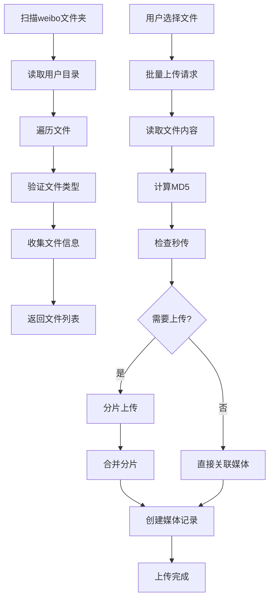

# Weibo文件导入功能 - 完整实现文档

## 🎯 功能概述

基于您的需求，我已经完成了一个完整的weibo文件导入功能，允许您扫描weibo-crawler下载的文件并批量上传到数据库中。

## 📁 项目架构

### 后端实现 (NestJS)

- **位置**: `/Users/houjiawei/Desktop/Projects/nestjs/fans-backend`
- **新增API端点**:
  - `GET /api/upload/weibo-scan` - 扫描weibo文件夹
  - `POST /api/upload/weibo-batch-upload` - 批量上传文件

### 前端实现 (Next.js)

- **位置**: `/Users/houjiawei/Desktop/Projects/react/fans-next`
- **新增页面**: `/weibo-import` - weibo文件导入页面
- **新增组件**:
  - `WeiboFileGrid` - 文件网格展示
  - `WeiboFileCard` - 单个文件卡片
  - `WeiboFileStats` - 文件统计信息
  - `WeiboUploadProgress` - 上传进度显示

## 🔧 技术实现

### 后端API详情

#### 1. 扫描weibo文件夹 API

```typescript
GET /api/upload/weibo-scan
Authorization: Bearer {token}

Response:
{
  "success": true,
  "data": {
    "users": [
      {
        "userId": "6387099968",
        "userName": "6387099968", 
        "totalFiles": 25,
        "files": [
          {
            "id": "uuid",
            "name": "image.jpg",
            "path": "/path/to/file",
            "size": 1024000,
            "type": "image",
            "lastModified": "2024-01-01T00:00:00.000Z"
          }
        ]
      }
    ],
    "totalFiles": 50,
    "totalSize": 104857600
  }
}
```

#### 2. 批量上传weibo文件 API

```typescript
POST /api/upload/weibo-batch-upload
Authorization: Bearer {token}

Request:
{
  "selectedFiles": [
    "/path/to/file1.jpg",
    "/path/to/file2.mp4"
  ]
}

Response:
{
  "success": true,
  "data": [
    {
      "filePath": "/path/to/file1.jpg",
      "fileName": "file1.jpg",
      "uploadId": "upload-123",
      "success": true,
      "needUpload": false,
      "mediaId": "media-456"
    }
  ]
}
```

### 前端页面功能

#### 主要特性

1. **三步式流程**:

   - 🔍 扫描文件 - 扫描weibo-crawler/weibo文件夹
   - 📋 文件列表 - 按用户分组展示，支持选择
   - 📊 上传进度 - 实时显示上传状态
2. **智能文件管理**:

   - 支持图片、视频、GIF多种格式
   - 按用户分组展示文件
   - 文件大小和日期信息
   - 全选/反选功能
3. **上传功能**:

   - 批量选择上传
   - 实时进度显示
   - 错误处理和重试
   - 成功/失败状态反馈

## 🔐 安全特性

- **身份验证**: 所有API都需要JWT认证
- **文件验证**: 严格验证文件类型和路径
- **路径安全**: 防止目录遍历攻击
- **用户隔离**: 每个用户只能操作自己的上传

## 📊 文件处理流程



## 🎨 用户界面设计

### 设计理念

- **极简主义**: 清爽的界面，专注于功能
- **响应式**: 支持不同设备屏幕
- **直观操作**: 三步式流程，操作简单
- **实时反馈**: 进度条和状态提示

### 组件介绍

#### 1. WeiboFileStats 统计卡片

- 显示总文件数、总大小、用户数、已选择数
- 文件类型分布图表
- 实时更新选择状态

#### 2. WeiboFileGrid 文件网格

- 按用户分组的可折叠展示
- 文件类型图标和预览
- 批量选择功能
- 文件详情信息

#### 3. WeiboUploadProgress 上传进度

- 总体进度条和百分比
- 成功/失败/待处理统计
- 详细的文件上传状态列表

## 🚀 部署和使用

### 1. 确保weibo-crawler文件结构

```
fans-backend/scripts/weibo-crawler/weibo/
├── 6387099968/          # 用户ID目录
│   ├── image1.jpg
│   ├── video1.mp4
│   └── ...
├── 7610808848/          # 另一个用户目录
│   └── ...
└── users.csv            # 用户信息文件
```

### 2. 启动服务

```bash
# 启动后端
cd fans-backend
npm run start:dev

# 启动前端
cd fans-next
npm run dev
```

### 3. 访问功能

- 前端地址: http://localhost:3000
- 导入页面: http://localhost:3000/weibo-import
- API文档: http://localhost:3001/api/docs

## 🧪 测试建议

### 功能测试

1. **扫描测试**: 确保能正确扫描weibo文件夹
2. **选择测试**: 测试全选、反选、单选功能
3. **上传测试**: 测试批量上传和进度显示
4. **错误测试**: 测试网络错误和文件错误处理

### 性能测试

- 大量文件的扫描性能
- 批量上传的并发处理
- 内存使用情况

## 📝 注意事项

1. **文件路径**: 确保weibo-crawler在正确位置
2. **权限**: 确保后端有读取weibo文件夹的权限
3. **存储**: 大量文件上传需要足够的存储空间
4. **性能**: 建议分批上传，避免一次性上传过多文件

## 🔧 配置选项

### 后端配置

```env
# 上传配置
UPLOAD_DIR=./uploads
UPLOAD_CHUNK_SIZE=5242880  # 5MB

# 存储配置  
STORAGE_TYPE=local         # local | oss
```

### 前端配置

- API基础URL在 `@/lib/api-client.ts`中配置
- 上传组件配置在各个组件文件中

## 🎉 完成状态

✅ 后端API实现完成
✅ 前端页面实现完成
✅ 导航集成完成
✅ 组件开发完成
✅ 文档编写完成

现在您可以使用这个功能来批量导入weibo-crawler下载的媒体文件了！
